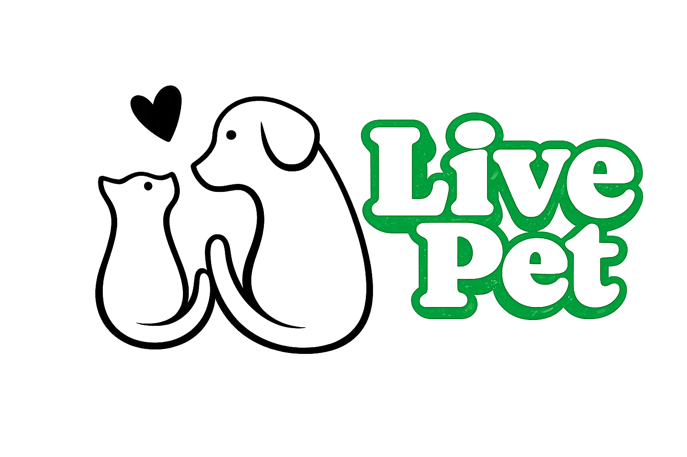

<div align="center">



# LivePet

**Cuidar nunca foi tão fácil.**
Plataforma integrada para gestão de saúde, identificação e conexões de animais de estimação.

<br>


<br>

[Ambientes em Produção](#-ambientes-em-produção-cloud---render) ·
[Funcionalidades](#funcionalidades) ·
[Começando](#começando) ·
[Estrutura](#estrutura-do-projeto) ·
[Contribuindo](#padrões-de-contribuição)

</div>

<br>

---

## 🌐 Ambientes em Produção (Cloud - Render)

O ecossistema LivePet está publicado e operando na nuvem:

| Serviço | Descrição | Link de Acesso | Monitoramento / Status |
| :--- | :--- | :--- | :--- |
| **Front-end Web** | Interface do usuário em React / Vite (SPA) | [livepet-1.onrender.com](https://livepet-1.onrender.com/) | [](https://livepet-1.onrender.com/) |
| **Back-end API** | API RESTful em Python / FastAPI | [livepet.onrender.com](https://livepet.onrender.com/) | [](https://livepet.onrender.com/) |
| **Documentação Interativa (Swagger)** | Teste e documentação interativa de endpoints | [livepet.onrender.com/docs](https://livepet.onrender.com/docs) | [](https://livepet.onrender.com/docs) |
| **Healthcheck da API** | Verificação de integridade e conexão com banco Neon | [livepet.onrender.com/health](https://livepet.onrender.com/health) | [](https://livepet.onrender.com/health) |

---

## Sobre

O LivePet reúne em um só lugar o que hoje fica espalhado entre cadernetas de papel, fotos no celular e planilhas: a carteira de vacinas, o histórico veterinário, o pedigree, a identificação do animal e a rede de parceiros que atende o tutor.

Desenvolvido como Projeto Integrador, com foco em usabilidade e em um fluxo que o tutor consiga percorrer sem manual.

<br>

## Tecnologias

<table>
<tr><td><b>Interface</b></td><td>React 18 · JavaScript · Vite 5</td></tr>
<tr><td><b>Estilização</b></td><td>Tailwind CSS · shadcn/ui (Radix) · Lucide React</td></tr>
<tr><td><b>Roteamento</b></td><td>React Router DOM 6</td></tr>
<tr><td><b>Dados assíncronos</b></td><td>TanStack React Query 5</td></tr>
<tr><td><b>Backend API</b></td><td>FastAPI (Python) · SQLAlchemy · PostgreSQL (Neon) · Supabase Auth / Storage</td></tr>
<tr><td><b>Cloud / Deploy</b></td><td>Render (Static Site para Front-end e Web Service para Back-end)</td></tr>
<tr><td><b>Formulários</b></td><td>React Hook Form · Zod</td></tr>
<tr><td><b>Testes</b></td><td>Pytest / Unittest (Backend) · Vitest (Frontend)</td></tr>
<tr><td><b>Documentos</b></td><td>jsPDF · qrcode.react · Recharts</td></tr>
</table>

> O projeto nasceu em TypeScript e foi migrado para JavaScript. Componentes novos gerados pelo shadcn/ui saem em `.jsx`, conforme `components.json`.

<br>

## Funcionalidades

| Rota | O que faz |
| :--- | :--- |
| `/login` | Autenticação e cadastro via Supabase Auth |
| `/pets` | Painel com os pets do tutor, alertas de vacina e acesso ao perfil |
| `/pets/novo` | Cadastro de pet com upload de foto |
| `/saude` | Carteira de vacinas — doses, prazos de reforço, status de pendência e avisos veterinários |
| `/historico-medico` | Exames, consultas e controle de peso com gráficos de evolução |
| `/matchpet` | Compatibilidade entre pets para cruzamento responsável ou adoção |
| `/pedigree` | Árvore genealógica de até três gerações e validador de certificados |
| `/cartao` | Identificação digital com QR Code, exportável em imagem ou PDF |
| `/tasks` | Lembretes e tarefas diárias de cuidado |
| `/parcerias` | Clínicas, petshops e prestadores com cupons de desconto |

<br>

## Começando

### Pré-requisitos

- Node.js 18 ou superior
- Um projeto criado no Supabase

### Instalação

```bash
git clone https://github.com/LIVEPET/LIVEPET.git
cd LIVEPET
npm install
```

### Variáveis de ambiente

```bash
cp .env.example .env
```

Preencha com as credenciais do seu projeto Supabase, em **Project Settings › API**:

```env
VITE_SUPABASE_URL=
VITE_SUPABASE_PUBLISHABLE_KEY=
VITE_SUPABASE_PROJECT_ID=
```

> **Importante.** O `.env` não é versionado. A chave publicável é protegida pelas políticas de Row Level Security do banco — ela não substitui essas políticas.

### Rodando

```bash
npm run dev
```

Disponível em **http://localhost:8080**

<details>
<summary><b>Build de produção</b></summary>

<br>

```bash
npm run build     # gera a pasta dist/
npm run preview   # serve o resultado localmente
```

Abrir o `index.html` diretamente no navegador não funciona: ele referencia o código-fonte processado pelo Vite, e módulos ES são bloqueados no protocolo `file://`. Use sempre `dev` ou `preview`.

</details>

<details>
<summary><b>Todos os scripts</b></summary>

<br>

| Comando | Função |
| :--- | :--- |
| `npm run dev` | Servidor de desenvolvimento com recarregamento automático |
| `npm run build` | Build otimizado para produção |
| `npm run build:dev` | Build em modo de desenvolvimento |
| `npm run preview` | Serve localmente o resultado do build |
| `npm run lint` | Análise estática com ESLint |
| `npm run test` | Executa a suíte de testes uma vez |
| `npm run test:watch` | Executa os testes em modo de monitoramento |

</details>

<br>

## Estrutura do projeto

```text
livepet/
├── supabase/
│   └── migrations/           Migrações SQL do banco
├── src/
│   ├── assets/               Imagens e recursos estáticos
│   ├── components/           Componentes reutilizáveis
│   │   └── ui/               Componentes base do shadcn/ui
│   ├── hooks/                Hooks customizados
│   ├── integrations/
│   │   └── supabase/         Cliente e configuração do Supabase
│   ├── lib/                  Utilitários e regras de negócio
│   ├── pages/                Páginas da aplicação
│   ├── test/                 Configuração da suíte de testes
│   ├── App.jsx               Roteador central e provedores de contexto
│   ├── main.jsx              Ponto de entrada do React
│   └── index.css             Estilos globais e design tokens
├── eslint.config.js
├── tailwind.config.js
├── vite.config.js
├── vitest.config.js
└── package.json
```

<br>

## Testes

Vitest com Testing Library em ambiente jsdom. Os arquivos ficam ao lado do código que testam, no formato `NomeDoArquivo.test.jsx`.

```bash
npm run test
```

<br>

## Padrões de contribuição

<table>
<tr>
<td width="50%" valign="top">

**Branches**

`tipo/numero-descricao`

Exemplo: `feat/8-carteira-vacinas`

Prefixos: `feat`, `fix`, `chore`, `docs`, `refactor`, `test`

</td>
<td width="50%" valign="top">

**Commits**

Conventional Commits, com a issue referenciada no corpo:

```
feat(saude): adiciona carteira de vacinas

Closes #8
```

</td>
</tr>
</table>

### Antes de abrir o pull request

```bash
npm run test && npm run lint && npm run build
```

A descrição deve trazer o resumo da alteração, o roteiro de teste para quem revisa e as observações relevantes. Pull requests acima de 400 linhas devem ser divididos, e ninguém aprova o próprio.

### Definição de pronto

- [ ] Testes, lint e build passando
- [ ] Interface verificada em 375 pixels de largura
- [ ] Estados de carregamento, lista vazia e erro implementados
- [ ] Migrações, quando houver, testadas em banco limpo

<br>

## Estado atual

Parte das telas ainda opera com dados de demonstração definidos em código. A integração com o Supabase está implementada na autenticação e no cadastro de pets.

Em aberto, acompanhado pela equipe:

| Item | Situação |
| :--- | :--- |
| Integração das listagens com o banco | Em andamento |
| Controle de acesso por papel — tutor, veterinário, administrador | Planejado |
| Proteção de rotas autenticadas | Planejado |
| Divisão do bundle por rota | Planejado |
| Ampliação da cobertura de testes | Contínuo |

<br>

---

<div align="center">

Projeto acadêmico sem fins comerciais.

</div>
